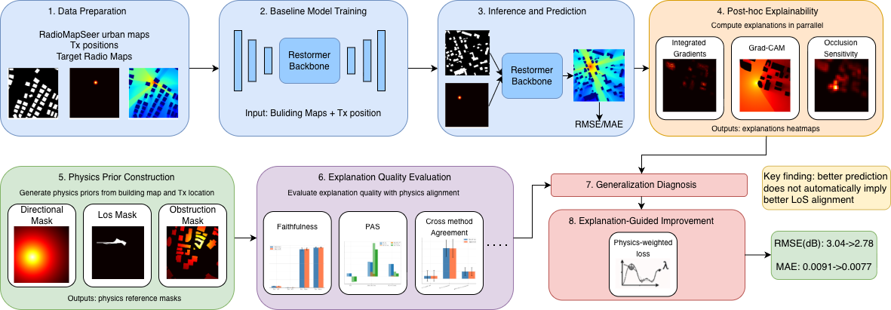
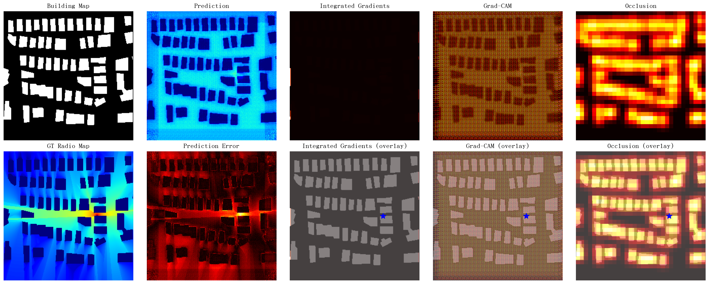
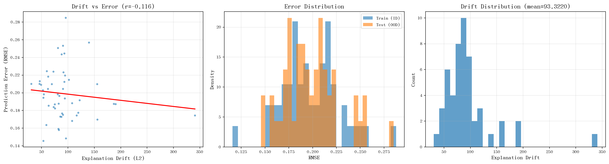

# Beyond Accuracy: An Explainable Radio Map Prediction Framework via Physical Alignment and Attribution-Based Diagnostics

This repository contains the official PyTorch implementation of the paper **"Beyond Accuracy: An Explainable Radio Map Prediction Framework via Physical Alignment and Attribution-Based Diagnostics"**. The project combines a Restormer-based predictor with post-hoc explanation methods, physics-inspired priors, and evaluation utilities for studying whether model behavior aligns with wireless propagation structure.



## Highlights

- Restormer-based radio map prediction pipeline
- Integrated Gradients, Grad-CAM, and occlusion sensitivity for explanation analysis
- Physics-inspired priors for line-of-sight, obstruction, and directional structure
- Metrics for faithfulness, physical alignment, stability, and consistency
- Analysis scripts for ID/OOD behavior, explanation drift, and failure cases

## Repository Layout

```text
radiomap-xai/
├── analysis/          # Evaluation and analysis scripts
├── assets/            # Lightweight figures used in the README
├── configs/           # Experiment configurations
├── datasets/          # RadioMapSeer dataset loader
├── explanation/       # Explanation methods
├── inference/         # Inference utilities
├── losses/            # Training losses
├── metrics/           # Explanation metrics
├── model/             # Restormer model implementation
├── priors/            # Physics-inspired priors
├── scripts/           # Helper scripts
├── training/          # Training and validation pipeline
├── visualization/     # Plotting helpers
└── run_experiment.py  # End-to-end pipeline entry point
```

## Installation

Create a Python environment with Python 3.10+ and install the dependencies:

```bash
pip install -r requirements.txt
```

## Dataset Preparation

This repository does not redistribute the RadioMapSeer dataset. Download the dataset from the official source and place the processed files under `data/` with the following structure:

```text
data/
├── antenna/
│   └── <map_id>.json
├── gain/
│   └── DPM/
│       └── <map_id>_<tx_idx>.png
└── png/
    └── buildings_complete/
        └── <map_id>.png
```

By default, the code expects `data.root_dir` in `configs/config.yaml` to point to `./data`.

## Quick Start

Train a baseline model:

```bash
python training/train.py --config configs/config.yaml
```

Run inference with a trained checkpoint:

```bash
python inference/infer.py --config configs/config.yaml --checkpoint outputs/checkpoints/best_model.pth --num_samples 10
```

Run the end-to-end pipeline:

```bash
python run_experiment.py --config configs/config.yaml --skip-training
```

Generate dataset visualizations:

```bash
python scripts/visualize_dataset.py
```

## Example Outputs

<table>
  <tr>
    <td></td>
    <td></td>
  </tr>
</table>

## Notes

- Checkpoints, logs, and full experiment outputs are intentionally excluded from the public release.
- The repository keeps output paths relative so results can be reproduced locally under `outputs/`.
- If the dataset path is missing, the loader raises a clear error describing the expected directory layout.

## Citation

If you use this code in academic work, please cite the paper:

```bibtex
@article{zhihao2025beyond,
  title={Beyond Accuracy: An Explainable Radio Map Prediction Framework via Physical Alignment and Attribution-Based Diagnostics},
  author={Zhihao, George and others},
  year={2025}
}
```

## License

Released under the MIT License.
